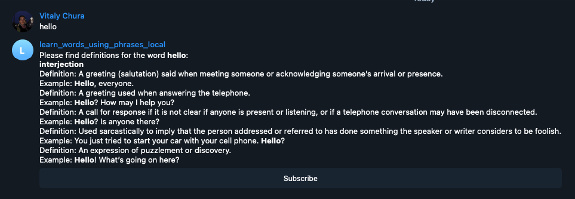

## LearnWordsUsingPhrasesBot

This bot can help you learn English words, it sends word definition and usage examples in response
to a message with a word.

Example:


### Running locally

Add the following variables to `LearnWordsUsingPhrasesApplication` run configuration:
```
TELEGRAM_BOT_TOKEN=<your_token>
OXFORD_API_APP_ID=<oxford_api_app_id>
OXFORD_API_APP_KEY=<oxford_api_app_key>
```

Please request Oxford API id and key from the repo admin.

Run `LearnWordsUsingPhrasesApplication`

### Running in Docker

Build an image:
```shell
docker build -t learn_words_using_phrases_bot:0.1 -f docker/Dockerfile .
```
Run the image:
```shell
docker run -itd --name learn_words_using_phrases_bot \
    -e TELEGRAM_BOT_TOKEN=<your_token> \
    -e OXFORD_API_APP_ID=<oxford_api_app_id> \
    -e OXFORD_API_APP_KEY=<oxford_api_app_key> \
    -e APPLICATION_PROFILE=local \
    docker.io/library/learn_words_using_phrases_bot:0.1
```
Clean up the container:
```shell
docker container rm learn_words_using_phrases_bot
```